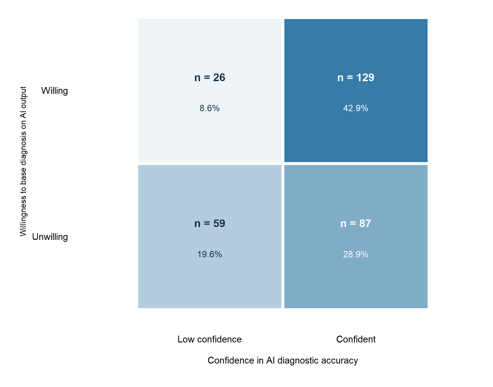
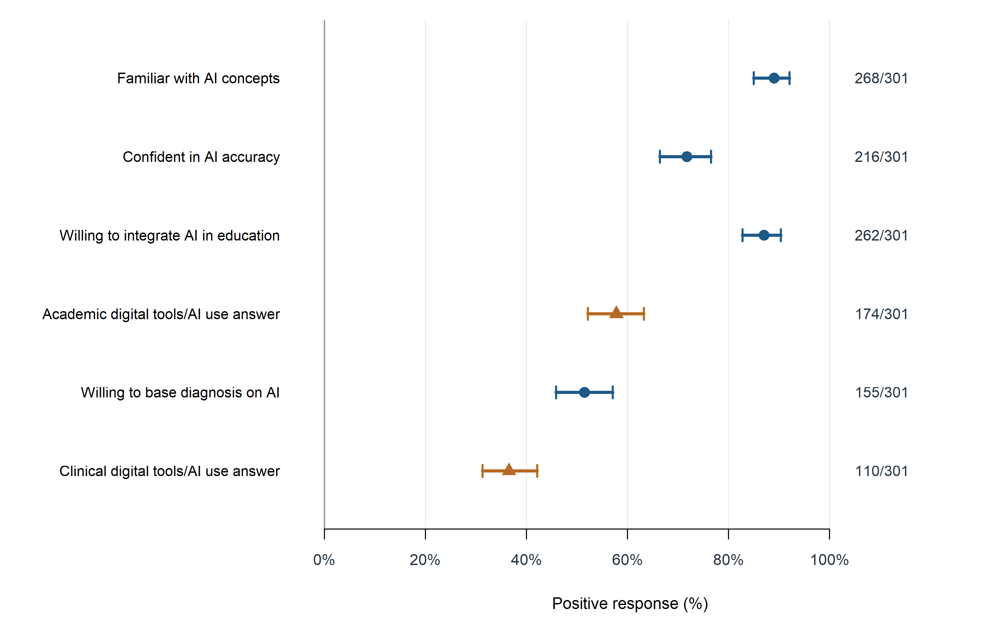
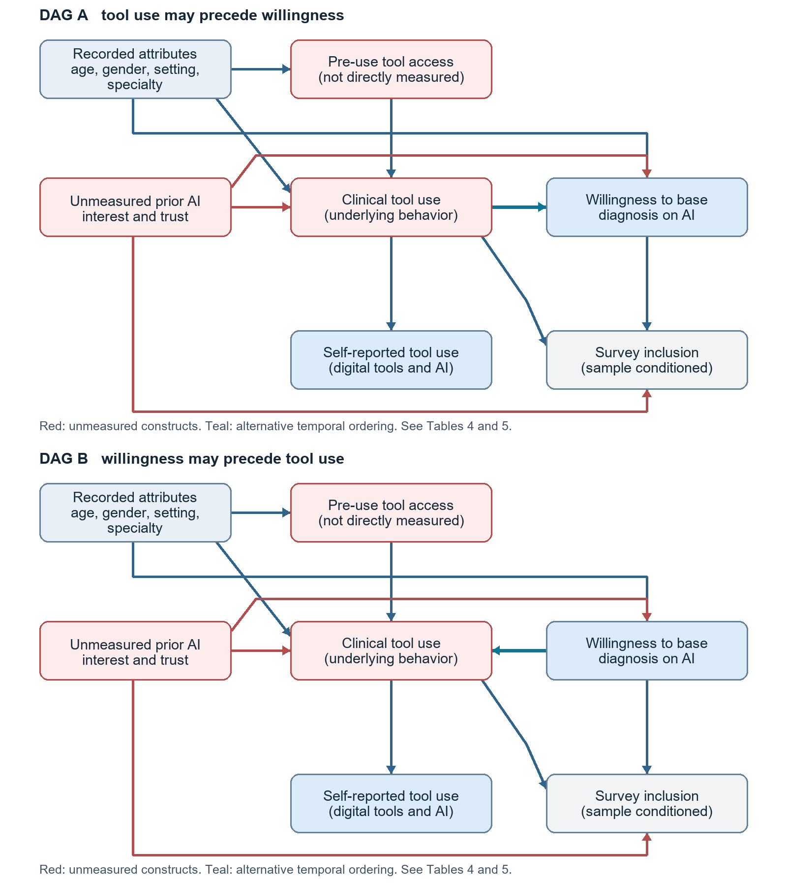

# Dental AI survey in Punjab and Islamabad

Reproducible statistical code and aggregate results for **Artificial intelligence familiarity, digital tool use, and diagnostic willingness among dentists in Pakistan: a cross-sectional survey**.

**Project status:** manuscript preparation; these results have not been presented here as peer-reviewed findings. The analyses were reproduced locally using a 301-record coded dataset. Original-response linkage and the institutional data-sharing decision remain outstanding. This repository contains code and aggregate results; it does not contain respondent-level data or consent records.

## Research question

How do familiarity with artificial intelligence, use of digital tools, confidence in AI diagnostic accuracy, and willingness to base a definitive diagnosis on AI output relate within this sample of dentists? The analysis also describes perceived implementation barriers and explores adjusted associations.

The cross-sectional convenience survey recruited graduate dentists engaged in clinical practice or dental academia in Punjab or Islamabad between 1 April and 31 July 2024. Eligible participants had at least one year of experience and were aged 60 or younger. Written informed consent was obtained from participants. Current BDS students were excluded. The study was approved by the Institutional Review Committee at Islamic International Dental College, approval IIDC/IRC/2024/002/010, dated 15 February 2024.

## Main findings

| Measure | Result in the analysed sample |
|---|---:|
| Participants | 301 |
| Familiarity with AI concepts | 268/301 (89.0%) |
| Reported clinical tool use | 110/301 (36.5%) |
| Confidence in AI diagnostic accuracy | 216/301 (71.8%) |
| Willingness to base a definitive diagnosis on AI output | 155/301 (51.5%) |
| Within-person confidence minus willingness difference | 20.3 percentage points; bootstrap 95% interval 14.0–26.9 |
| Clinical tool-use association with willingness | Adjusted odds ratio 1.98; 95% CI 1.19–3.28 |
| Standardized absolute use–willingness association | 16.0 percentage points; bootstrap 95% interval 4.3–27.8 |
| Most frequently selected barriers | High cost: 196/301 (65.1%); insufficient knowledge: 177/301 (58.8%) |

The administered use questions combine **digital tools and AI technologies**. These estimates must not be labelled AI-specific adoption. Confidence and willingness are different attitudes; neither is an observed diagnostic decision or a test of competence. Convenience recruitment limits generalizability, and simultaneous measurement does not establish causal direction.

## Analyses

| Component | Method and purpose |
|---|---|
| Descriptive responses | Counts, denominators and Wilson 95% intervals; individual barrier indicators, without an unvalidated composite scale |
| Paired responses | Complete 2 × 2 confidence/willingness table and 5,000-resample paired bootstrap interval |
| Adjusted associations | Two logistic regressions, with documented background covariates, reference groups, odds ratios and Wald intervals |
| Absolute association | Sample standardization under positive and negative use responses, with 2,000 bootstrap refits |
| Robustness | Alternative experience adjustment, repeated-pattern sensitivity, additional adjustment, reverse-outcome model, interactions, overlap and leave-one-record-out checks |
| DAGs and pathways | Two alternative conceptual orderings; all 12 descriptive overall/direct/indirect decompositions with 1,000 bootstrap samples each |
| Numerical diagnostics | All 24,024 pathway-model fits converged; 45/12,000 bootstrap replicates met an extreme-fit screen. All primary replicates were retained. |
| Ensemble feasibility | Separate nested repeated cross-validation pilot; excluded from manuscript findings because added predictive value and a deployment use were not established |

Direct and indirect components describe mathematical decompositions of fitted associations. They are **not causal mediation effects**. No proportion mediated, causal pathway confirmation, clinical prediction claim, or superiority of the ensemble is asserted. The pilot's learner library included an intercept model, two logistic specifications and a shallow decision tree; it did not include gradient boosting.

## Repository layout

| Location | Contents |
|---|---|
| `run_all.R` | One entry point for input checks, manuscript analyses, tidy outputs, figure generation and reference-value checks |
| `analysis_*.R` | Four manuscript scripts and a separately labelled optional ensemble pilot |
| `prepare_dataset.py` | Lossless export and codebook generation from the coded Jamovi archive, with explicit quality flags |
| `render_figures.R`, `build_dags.py` | Reproducible data figures and conceptual DAG figures |
| `reference_table5.csv` | All 108 rounded pathway-table values from the reviewed manuscript |
| `aggregate_results/` | Reviewed tables, numerical diagnostics and aggregate analysis logs; no fitted-model objects |
| `figures/` | Fig 1, S1 Fig and S2 Fig |
| `docs/` | Statistical specification, source limitations and data-access status |
| `tests/check_public_release.py` | Checks aggregate reproduction values and excludes prohibited participant-level filenames and object types |

## Reproduction and data access

**The public code repository alone cannot rerun participant-level analyses.** An approved local data package is required. No institutional access route has yet been finalized, so this repository does not promise access on request or claim that participation consent permits unrestricted data release.

Authorized users with the complete local package should place its protected `data/` directory next to `run_all.R`, preserving all filenames. That directory contains the coded archive, 301 × 42 CSV, codebook, labels, recodes, quality flags and checksums. It must remain excluded from Git history.

The completed local run used R 4.6.1, Python 3.12.14, Pillow 12.3.0 and, for the optional pilot, rpart 4.1.27. Statistical analyses require base R; Python/Pillow renders S2 Fig. The DAG renderer supports Arial, Liberation Sans or DejaVu Sans. Runtime details are included with the aggregate results. No dependencies are installed automatically.

```text
Rscript run_all.R
```

To retain a previous output directory and include the optional pilot:

```text
Rscript run_all.R results_with_pilot --with-pilot
```

If Python is not on PATH, set `DENTAL_AI_PYTHON` to its executable. To reproduce the data export from the approved coded archive, run `python prepare_dataset.py` first. The default output directory is `results/`; this directory is ignored because fitted model objects can retain participant-level information. Only reviewed aggregate files are copied into `aggregate_results/`.

Anyone can run the checks on the committed aggregate outputs without participant data:

```text
python tests/check_public_release.py
```

## Verification and limits

The local export preserves all 12,642 coded cells, all 42 source columns and all 301 records. An independent archive decoder reproduced the exported values. There are no missing coded cells or invalid codes in the labelled fields. This establishes computational fidelity to the supplied coded archive, not fidelity to an untouched survey export.

Two undocumented aggregate columns disagree with counts of their component selections in nine records. They are retained in the protected complete dataset, flagged explicitly, and excluded from manuscript analyses. The individual barrier indicators are analysed. A repeated response pattern is retained because identical answers do not prove duplicate participation. Coding-boundary discrepancies and unavailable recruitment linkage are documented in `docs/DATA_STATUS.md`.

All 108 displayed pathway values match the manuscript to rounding, and overall equals direct plus indirect before rounding. Primary bootstrap intervals retain all resamples. Diagnostic-only omission of extreme fits shifted the largest interval endpoint by 1.65 percentage points without changing the affected intervals' inclusion of zero. These numerical checks do not resolve selection, measurement, unmeasured confounding or temporal-order limitations.

## Project responsibility

Repository maintainer and manuscript corresponding author: **Javed Ashraf**. Final author contributions, publication submission and data-access decisions remain the study team's responsibility. No journal acceptance, institutional endorsement, or completed public-data approval is implied.

OpenAI Codex assisted with substantive drafting, code development, literature identification and figure code. Scripts were executed, displayed values checked against outputs, and core estimates independently recomputed. The assistance does not replace author scientific review. No reuse licence has been selected for this initial repository; an explicit licence can be added by the rights holder.

## Figures

**Fig 1. Paired confidence and willingness.** Counts and percentages use all 301 respondents. These are simultaneous answers to different questions, not a before-and-after comparison. Plotting code was developed with OpenAI Codex assistance and its values were checked against the paired analysis.



**S1 Fig. Individual positive-response proportions.** Whiskers are Wilson 95% intervals. Orange triangles identify questions that combine digital tools and AI technologies. Code was developed with OpenAI Codex assistance; counts and interval endpoints were checked against the numerical output.



**S2 Fig. Alternative conceptual orderings.** Red nodes identify unmeasured constructs; the self-report is an observed measure of broader digital/AI use. The arrows express hypotheses, not fitted effects. Code was developed with OpenAI Codex assistance; diagram labels and pathway descriptions were reviewed for consistency.


